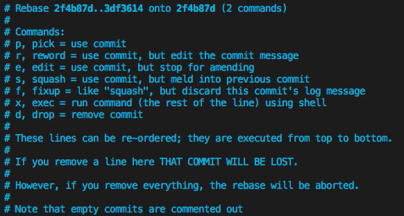

# Documentação dos comandos GIT: rebase, cherry pick, revert e squash

## Sumário:
1. ### [git rebase](#git-rebase-1)
    - [Funcionamento](#funcionamento)
    - [Sintaxe](#sintaxe)
    - [Aplicação](#aplicação)

2. ### [git cherry pick](#git-cherry-pick-1)
    * [Funcionamento](#funcionamento-1)
    - [Sintaxe](#sintaxe-1)
    - [Aplicação](#aplicac3a7c3a3o-1)

3. ### [git revert](#git-revert-1) 
    - [Funcionamento](#funcionamento-2)
    - [Sintaxe](#sintaxe-2)
    - [Aplicação](#aplicação-algumas-opções)

4. ### [git stash](#git-stash-1)
    - [Funcionamento](#funcionamento-3)
    - [Sintaxe](#sintaxe-3)
    - [Aplicação](#aplicac3a7c3a3o-2)

<br>

# git rebase

### Funcionamento

### Sintaxe

### Aplicação

<br>

# git cherry pick

### Funcionamento

### Sintaxe

### Aplicação

<br>

# git revert

### Funcionamento

#### Dado um ou mais commits já existentes, reverta as alterações introduzidas pelos patches relacionados e registre alguns novos commits que registram neles. Isso requer que a sua árvore de trabalho esteja limpa (nenhuma alteração a partir do commit HEAD).

### Sintaxe
#### git revert

### Aplicação (Algumas opções)

#### "commit"​
#### Commits que serão revertidos.

#### -e
#### --edit
#### Com esta opção, o comando git revert permitirá a edição da mensagem do commit antes de fazer a reversão do commit. Esta é a predefinição caso execute o comando em um terminal.

#### --abort
#### Cancele a operação e retorne a condição pré-sequência.

### Referência
#### [Documentação Git](https://git-scm.com/docs/git-revert/pt_BR)

<br>

# git squash

### Funcionamento
Após um tempo já desenvolvendo/construindo um recurso em uma ramificação, o histórico git de pequenas e idependentes confirmações acaba por sobrecarregar o histórico de construção do recurso. Sendo assim, para resolver este problema, existe o squash, ele basicamente combina os commits para garantir um histórico mais limpo usando squash.

- ### Onde pode ser usado:
  - Histórico de commits.
  - Branchs.

- ### Exemplo:

  - #### Commits:
    1. c98jo89
    2. c7820cm
    3. 8c1a12v
    
    <br> => 23ab609

### Sintaxe
 ```
 git rebase -i HEAD~{Quantidade}
 ```


| PARTE | FUNÇÃO |
|:------|-------:|
| rebase | Move commits para um novo commit base|
| -i | Interativo, ou seja, trará um menú com opções que auxiliam na junção dos commits ou branchs |
| HEAD~ | Referencia aos commits referentes ao atual |
| {Quantidade} | Quantidades de commits anteriores em que serão juntados | 

### Aplicação
+ Exemplos commits:
  + 28ddeb6
  + 28ddeb6

<br>

1. ```git rebase -i HEAD~3```

2. 

3. pick 28ddeb6 

4. squash 28ddeb6

5. esc + :wq

6. Editar mensagem da junção (OPCIONAL)

7. esc + :wq

Fim!